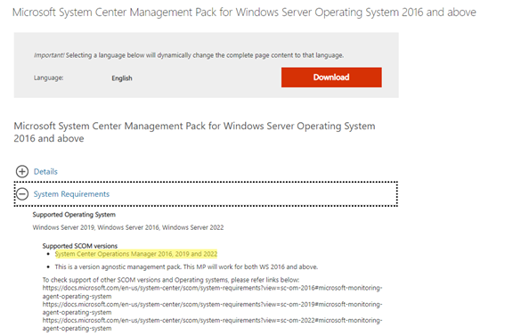

<!-- more -->
皆さまこんにちは、System Center サポートチームの保科です。
本日は、System Center Operations Manager (以降は SCOM と略称) をアップグレードせずに新規環境を構築された場合、既存環境の一部設定を新規環境へ以降する手順をご紹介いたします。

# 概要
2022 年になり SCOM 2016 が延長サポート期間へ移行したり、SCOM 2012 系は延長サポート期間が終了となりました。
このように、SCOM に限らず弊社がリリースしておりますオンプレミス製品は原則としてサポート期間が設定されております。
サポート期間終了に伴い、古いバージョンの SCOM をご利用のお客様においては、サポート期間中の SCOM 環境へリプレースされることをご検討いただいている状況と存じます。
SCOM 環境のリプレースには、既存環境のアップグレードと、既存環境と並行して新規環境を作成いただく 2 種類の方法がございます。
詳細は、本ブログ内で別途公開しております下記ページも併せてご確認ください。
[SCOM 2016 から SCOM 2022 へ移行 or アップグレードについて](https://jpsystemcenter.github.io/blog/SCOM/SCOM_migration/)

本記事では、新規環境へ設定を移行する方法について、移行に使用する管理パックの概要と含めて詳細な手順をご説明いたします。

# 管理パックとは
"概要" 項でも簡単に触れました通り、既存環境から新規環境へ設定を移行する場合、管理パックを使用して移行を行います。
管理パック移行方法の解説の前に、管理パックとはそもそも何かについてご説明いたします。

管理パックは、SCOM におけるいわゆるプラグインのような働きをするファイルとなります。
管理パックを SCOM 環境内に導入いただくことで、初期状態では存在しない、サーバーの CPU 使用率の監視といった監視機能の拡張を行うことが出来ます。
管理パックによって提供される内容は様々な内容が存在し、下記の弊社サイトにも詳細が掲載されております。
[Operations Manager の管理パックに含まれている内容](https://docs.microsoft.com/ja-jp/system-center/scom/manage-overview-management-pack?view=sc-om-2022)

こちらのサイトに記載された、管理パックに含まれる内容を抜粋いたします。
>管理パックには通常、アプリケーションとサービスの監視設定が含まれます。 管理パックが管理グループの System Center - Operations Manager にインポートされると、既定の構成と管理パックで定義されたしきい値に基づいて直ちにオブジェクトの監視が開始されます。
>各管理パックには次の部分のいずれかまたはすべてが含まれていることがあります。
>- 管理されたコンポーネントの各種要素の状態を追跡するよう、エージェントに指示を送るモニター。
>- パフォーマンス データや検出データの収集やアラートやイベントの送信などを行うよう、エージェントに指示を送るルール。
>- エージェントまたはコンソールが実行可能なアクティビティを定義する、タスク。
>- オペレーターが診断や問題解決できるよう、テキストでアドバイスを出すナレッジ。
>- このコンポーネントの監視や管理用にカスタマイズしたユーザー インターフェイスを提供する、表示。
>- この管理されたコンポーネントに関する情報を報告するための特定の方法を定義する、レポート。
>- 監視されるべきオブジェクトを特定する、オブジェクト検出。
>- 異なるコンピューターの異なるアカウントでさまざまなルール、タスク、モニター、検出を実行することを可能にする、実行プロファイル。

上記の事項については管理パックに含まれる内容となります。
そのため、管理パックをエクスポートいただくことで、上記設定を纏めてエクスポートいただくことが可能となります。
その後、エクスポートされた管理パックを新規環境にインポートいただくことで、上記設定については従前どおりの設定でご利用いただけます。

しかし、逆の言い方をすれば、管理パックに含まれない内容についてはエクスポートすることが出来ないため、新規環境に引き継ぐことは出来ません。
これには、例えば現在監視されているサーバーならびにその監視設定、今までの監視データやアラート情報、実行アカウント、SCOM データベースのクリーンアップ設定等が含まれます。
管理パックに含まれない内容については、従前の環境と同等の設定を手動で実施いただく必要がございます。
また、今までの監視データはすべて喪失することとなりますので、予めご了承ください。

管理パックは、大きく分けると下記の 2 種類に分けることが可能です。
- 弊社やサードパーティから提供されている管理パック:
監視されたいハードウェアやソフトウェア用に、弊社やサードパーティから管理パックがリリースされております。
それらの管理パックを導入することで、その管理パックによって提供される監視機能の一式が提供されます。
例えば、Windows Server 2016 以降の Windows Server OS を監視する弊社提供の管理パックを導入することで、その OS の監視が実現いただけます。
管理パック毎に提供される監視機能はその管理パックの実装面で定義されております。
- お客様が SCOM 運用に際して独自に作成いただいた管理パック:
SCOM で動作するルールやモニターは、オーバーライドを行うことでお客様の監視要件に応じて動作方法やアラートのしきい値といった設定値を変更いただけます。
また、お客様の監視要件に応じて、SCOM ではお客様が独自にルールやモニターを作成いただける仕組みもございます。
こういった内容を保存する際に、お客様の方で SCOM 内に独自の管理パックを作成いただくことが可能です。

今回の移行手順のご案内では、上記 2 種類の管理パックを移行する手順をご案内としております。
それでは、具体的に管理パックをどのように移行することが可能か説明していきます。

# 具体的な管理パック移行方法
既存環境から新規環境に管理パックを移行する方法として、大きく分けて下記の手順を実施いただきます。
1. 既存の SCOM 環境から管理パックをエクスポート
2. 既存環境からエクスポートされた管理パックを新規 SCOM 環境にインポート

各手順の詳細をご案内いたします。

## 1. 既存の SCOM 環境から管理パックをエクスポート
こちらの手順は、既存環境より新規環境に移行するための管理パックをエクスポートする手順となります。
エクスポートを実施いただく場合、下記手順を実施します。
1. 管理者の権限を持つユーザーで Operations Manager 管理サーバーにログオンします。
2. C: ドライブの直下に MPs フォルダーを作成します。
3. [スタート] 画面から [Operations Manager Shell] を選択します (※)。
4. [Operations Manager Shell] ウィンドウのプロンプトで以下のコマンドを実行します。
> Get-SCOMManagementPack | Export-SCOMManagementPack -Path:C:\MPs

こちらの手順を実施いただくと、"MPs" フォルダに、SCOM でご利用のすべての管理パックが "<SCOM に保存された管理パックの名称>.xml" のファイル名でエクスポートされます。
管理パックの名称にスペースが存在する場合、スペースは “.” に変換の上エクスポートされます。
管理パックの名称に日本語が 1 文字でも含まれる場合、エクスポートされる管理パックは “ManagementPack<管理パック毎の固有文字列>” の名称でエクスポートされます。
このエクスポートされた管理パックの内、お客様が独自に定義された管理パックを新規環境に移行します。

## 2. 既存環境からエクスポートされた管理パックを、新規 SCOM 環境にコピー
下記の説明では、特にご要望が多い以下の観点でご案内いたします。
1) 独自定義ルール / モニターのインポート方法
2) ルール / モニターの上書き設定のインポート方法
3) 配信登録設定のインポート方法

### 1) 独自定義ルール / モニターのインポート
"1. 既存の SCOM 環境から管理パックをエクスポート" でエクスポートされた管理パックの内、独自定義ルール / モニターを作成される際に指定された管理パックを新規環境にコピーします。
その管理パックを新規環境にインポートいただくことで、新規環境でもそのモニターをご利用いただくことが可能となります。

### 2) ルール / モニターの上書き設定のインポート
"1. 既存の SCOM 環境から管理パックをエクスポート" でエクスポートされた管理パックの内、既存環境で上書き設定を保存さる際に使用された管理パックを、新規環境にコピーします。
なお、新規環境に存在しないルール / モニターの上書き設定が保存されている管理パックを新規環境でインポートしようとすると、依存関係となる管理パックが存在しないとして、インポートが実施いただけない場合がございます。
この依存関係となる、新規環境に存在しないルール / モニターは、例えば Exchange Server 管理パックで使用いただけるルール / モニター等、お客様にて別途入手いただく必要がある管理パックが該当いたします。
この場合、まず "1. 既存の SCOM 環境から管理パックをエクスポート" でエクスポートされた管理パックより、当該管理パックと依存関係となる管理パックを新規環境にコピーおよびインポートいただきます。
基本的に、依存関係となる管理パックは既存環境に存在しますので、依存関係に関するエラーが出力されましたら、既存環境から依存関係となる管理パックをコピーいただきます様お願いいたします。
通常であれば、お客様が別途入手された管理パックは、すべて既定で下記フォルダ上に保存されます。
> C:\Program Files (x86)\System Center Management Packs

そのため、既存環境上に存在するこちらのフォルダを全て新規環境にコピーいただき、フォルダ内の管理パックの内新規環境のバージョンで使用することをサポートされる管理パックを全てインポートします。

### 3) 配信登録設定のインポート
SCOM では、特定のアラートをトリガーとしてスクリプトを実行したり、そのアラート内容を特定のアドレスにメール通知する配信登録設定が提供されております。
配信登録設定については、下記の弊社サイトにも詳細な内容が掲載されております。
[Operations Manager でアラート通知をサブスクライブする](https://docs.microsoft.com/ja-jp/system-center/scom/manage-notifications-alert-notifications?view=sc-om-2022)

こちらの機能は、多くのお客様がアラート情報を担当者に迅速に連携するべくご利用いただいている状況かと思います。
この設定も、"1. 既存の SCOM 環境から管理パックをエクスポート" でエクスポートされた管理パックの内 "Microsoft.SystemCenter.Notifications.Internal.xml" を新規環境にインポートいただくことで、既存環境の配信登録設定を引き継いで利用いただくことが可能です。
なお、インポートの際は、既に新しいバージョンの管理パックがインポートされている旨の情報が表示されますが、
インポート自体は可能で、この状態でインポートいただいても問題ございません。
弊社検証環境での動作内容や過去事例より、古いバージョンの管理パックを上書きする形で新規環境にインポートいただくことで、
SCOM の動作上特に問題が発生しないことを確認しております。
一例として、SCOM 2012 から 2019 へ当管理パックをインポート後、SCOM 2012 にて設定いただいた内容が正常に SCOM 2019 側へ反映されることも確認しております。
念のため、既存環境の "Microsoft.SystemCenter.Notifications.Internal.xml" を新規環境にインポートいただく際は、
"1. 既存の SCOM 環境から管理パックをエクスポート" 項の手順に沿って一度新規環境内の管理パックを全てエクスポートしてください。
その後、新規環境内にてエクスポートされた "Microsoft.SystemCenter.Notifications.Internal.xml" を任意のフォルダにコピーします。
これにより、万が一既存環境の "Microsoft.SystemCenter.Notifications.Internal.xml" を新規環境へインポート後に予期せぬ動作が発生された場合、既存環境よりエクスポートいただいた "Microsoft.SystemCenter.Notifications.Internal.xml" をインポートいただくことで、状況を改善いただけます。

なお、管理パックの上書きインポートという作業の性質上、新規環境の配信登録設定はすべて既存環境の設定に上書きされることとなります。
新規環境で既に配信登録設定が実施されている場合、その設定もすべて消失されることとなりますのでご注意ください。

### (ご参考) 管理パックのインポート方法
管理パックのインポート方法は、下記の弊社サイトに詳しく掲載されております。
[Operations Manager 管理パックをインポート、エクスポート、および削除する方法](https://docs.microsoft.com/ja-jp/system-center/scom/manage-mp-import-remove-delete?view=sc-om-2022#import-a-management-pack-from-disk)
本ページ内で解説しております操作を実施いただく手順としては、"管理パックをディスクからインポートする" 項の手順が適切になります。

# 管理パックインポート時のご注意事項
少なくとも弊社より提供されております管理パックについては、その管理パックのインポートをサポートする SCOM バージョンが予め指定されております。
SCOM における非サポートの管理パックをインポートすることは、"管理パック自体は動作し、使用することが出来るものの、使用に際して予期せぬ動作が発生される可能性がある" ことを意味します。
そのため、非サポートの管理パックをインポートいただく際は、予期せぬ動作が発生することをご理解いただいた上でインポートしてください。
非サポートの管理パックによる監視によって問題が発生された場合、弊社としてはその管理パックを削除いただく以外の対処方法のご案内をいたしかねますので、予めご了承ください。

弊社が公開しております管理パックは、下記サイトにて一覧で掲載されております。
[Microsoft Management Packs](https://social.technet.microsoft.com/wiki/contents/articles/16174.microsoft-management-packs.aspx)
この一覧から、例えばサイト内の下図管理パックのリンク先へ遷移しますと、管理パックならびに管理パックガイドがダウンロードいただけます。

このページの ”System Requirements” を確認いただくことで、管理パックのサポート範囲を確認いただけます。
今回の例で確認しました、Windows Server 2016 以降の Windows Server OS を監視する際に使用する "Windows Server Operating System 2016 and above" 管理パックは、SCOM 2016 / 2019 / 2022 で使用することをサポートすることが確認いただけます。

また管理パックガイドからも同様の内容を確認いただけます。
こちらの管理パックでは、ドキュメント内の ”Supported Configurations” 項から内容をご確認いただけます。

管理パックのドキュメントは、対応する管理パックによって記述の意匠が異なります。
そのため、管理パックのドキュメントからサポートする SCOM バージョンを確認される場合、適宜そのドキュメントからサポート対象に関する内容をご確認ください。

SCOM 2019 のみではありますが、SCOM 2019 で使用することをサポートする管理パックが一覧で掲載されております。
[SCOM 2019 Management Packs](https://social.technet.microsoft.com/wiki/contents/articles/52876.scom-2019-management-packs.aspx)
そのため、SCOM 2019 に関しては、上記の手順による確認ではなく、こちらのサイトからサポートされる管理パックをご確認いただくのが有用でございます。