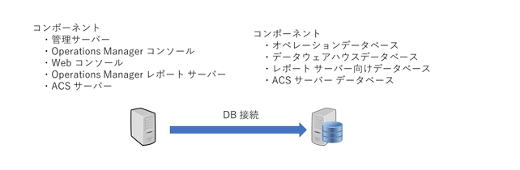
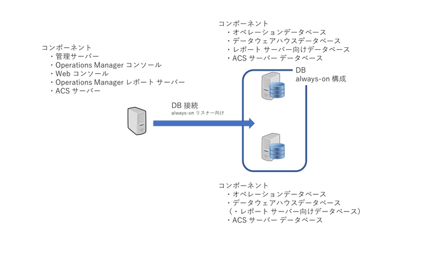
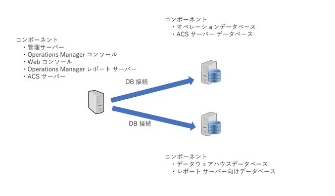

<!-- more -->
皆様こんにちは、System Center サポートチームの 佐藤 です。
本日は SCOM サーバーを構成するコンポーネント、ならびにコンポートネントをホストする OS の台数のよって取り得る構成についてご紹介いたします。

## SCOM サーバーを構成するコンポーネント
まず SCOM サーバーを構成するコンポーネントについては下表に記載いたします。

| コンポーネント  | 説明  |
| ------------ | ------------ |
| 管理サーバー  | SCOMの管理サーバーとして、管理対象とデータベース、オペレーションコンソールとの通信チャネルを提供します。複数の管理サーバーを導入することで、負荷分散と冗長化が可能です。|
|  オペレーションデータベース | 管理グループ内のすべての構成情報、オペレーション情報、セキュリティ情報などを保存する SQL データベースです。 |
|  データウェアハウスデータベース | オペレーション情報を長期間、保存する SQL データベースです。  |
|  Operations Manager コンソール | GUI ベースのユーザーインタフェースです。SCOM のほとんどの操作はオペレーションコンソールから実行できます。  |
|  Webコンソール | Web ベースのユーザーインタフェースで、監視に特化されています。  |
|  Operations Manager レポートサーバー | データウェアハウスデータベースの情報を元にレポートの作成と表示をおこないます。  |
|  レポートサーバー向けデータベース | レポートを表示する際に参照される SQL データーベースです。  |
|  ACSサーバー | セキュリティログを収集し、ACSデータベースに保存します。  |
|  ACSデータベース | セキュリティログを保存するSQLデータベースです。  |

上記それぞれのコンポーネントをインストールするためのハードウェア / ソフトウェア要件がそれぞれございます。
主な要件については下記ページに記載しておりますのでご参照ください。

### SCOM サーバーを構成するコンポーネントの要件
- SCOM 2019
   - [SCOM 2019 のシステム要件](https://docs.microsoft.com/ja-jp/system-center/scom/system-requirements?view=sc-om-2019)
   - [SCOM 2019 のSQL Server の設計に関する考慮事項](https://docs.microsoft.com/ja-jp/system-center/scom/plan-sqlserver-design?view=sc-om-2019)
- SCOM 2022 
   - [SCOM 2022 のシステム要件](https://docs.microsoft.com/ja-jp/system-center/scom/system-requirements?view=sc-om-2022)
   - [SCOM 2022 のSQL Server の設計に関する考慮事項](https://docs.microsoft.com/ja-jp/system-center/scom/plan-sqlserver-design?view=sc-om-2022)

## SCOM サーバー の取り得る構成
ここまで上記コンポーネントの説明、ならびにその要件を記載させていただきましたが、以下に具体的な構成について記載します。

### OS が 1 台の場合
1 台のサーバー管理グループに展開するのは、評価やテスト、管理パックの開発など、通常、ラボ、開発、または実稼働以外の環境にインストールする場合を想定しております。

構築方法については下記参考ページをご参照ください。　　

[Operations Manager を 1 台サーバー構成で展開する](https://docs.microsoft.com/ja-jp/system-center/scom/deploy-single-server?view=sc-om-2019)
[Operations Manager を 1 台のサーバーにインストールする手順](https://docs.microsoft.com/ja-jp/system-center/scom/quickstart-install-single-server?view=sc-om-2019)

### OS が 2 台の場合
管理グループを分散インストールすると、複数のサーバーに機能とサービスを配布して、環境を拡張できます。 
[SQL Server の設計に関する考慮事項](https://docs.microsoft.com/ja-jp/system-center/scom/plan-sqlserver-design?view=sc-om-2019)に記載しているように中規模から大規模の分散型展開では、SQL Server インスタンスを専用スタンドアロン サーバーまたは SQL Server 高可用性構成に配置する必要があります。

OS が 2 台の場合、具体的には下図のように DB 機能とサーバー機能を分散させます。

> [!WARNING]
> システム要件に明確に記載しておらず恐縮ですが、`以下の構成は実績上取れない事を確認しているため避ける`ようお願いいたします。
> -  OS1 と OS2 で WSFC 構成を取り、DB（オペレーションデータベース / データウェアハウスデータベース） を always-on や FCI (Failover Cluster Instance) として構成
> -  その OS1 もしくは OS2 上に 管理サーバーを構築する構成。

もし 2 台(この場合は OS というより故障の単位となる筐体でしょうか）で管理サーバー、及びデーターベース機能を冗長構成とすることが必須の場合は、WSFC の役割りとして VM ごと冗長構成とすることをご検討ください。
WSFC のフェールオーバー機能を使用して、片方（OS1）が故障した際に、もう片方（OS2）にフェールオーバーする構成となります。別途 CSV を担うサーバー/機能が必要となります。
しかし、上記「 OS が 1 台の場合」に記載しておりますとおり、
 1 台のサーバー管理グループに展開するのは、評価やテスト、管理パックの開発など、通常、ラボ、開発、または実稼働以外の環境にインストールする場合を想定している点についてご留意くださいませ。

### OS が 3 台の場合

OS が 3 台の場合は
DB 機能を [always-on 構成](https://docs.microsoft.com/ja-jp/system-center/scom/plan-sqlserver-design?view=sc-om-2022#sql-server-always-on-1) で冗長化させる構成（パターン 1）
または
オペレーションデータベース と データウェアハウスデータベースを別 OS として構成（パターン 2）
が考えられます。

#### パターン 1

この場合にレポートサーバー向けデータベース構成については、always-on の可用性グループには登録できない点ご留意ください。
レポートサーバー向けデータベースをホストする OS が故障した際には [Reporting Server の役割を移動する方法](https://docs.microsoft.com/ja-jp/system-center/scom/manage-move-reporting-services-role?view=sc-om-2019)
に従いもう片方の OS 上で構築するようお願いいたします。
尚、データウェアハウスデーターベースが健在であれば、その情報からレポーティングに必要なデーターベースは構成可能でございます。

下記に当社の海外エンジニアが記載したレポーティングサーバーの取り得る構成について記載した下記ブログがございますので、よろしければご参照ください。
[レポーティングサーバーの取り得る構成](https://techcommunity.microsoft.com/t5/system-center-blog/operations-manager-reporting-8211-supported-ssrs-configurations/ba-p/340385)

#### パターン 2

当構成に関する情報は[Operations Manager データ ウェアハウス データベース](https://docs.microsoft.com/ja-jp/system-center/scom/plan-sqlserver-design?view=sc-om-2019#operations-manager-data-warehouse-database)
に以下のように記載しております。

レポート データ ウェアハウスは Operations Manager データベースとは別のサーバーに配置することを検討してください。 小規模の展開では、多くの場合、Operations Manager データベースとレポート データ ウェアハウスを同じサーバーで統合できますが、エージェントの数と入ってくるオペレーション データの量を増やすときに、分離すると効果的です。 レポート データ ウェアハウスとレポート サーバーが `Operations Manager データベースとは別のサーバーにあると、レポート パフォーマンスが向上します`。

#### 2 パターンのすみ分け
上記 2 パターンのすみ分けとしては以下が考えられますので、お客様の構成時の参考にしていただければ幸いです。
　-データのリアルタイム保護性を重要視する（重要視する運用方針の場合）
　　　-> パターン 1 を選択
　-処理を分散させることで、処理負荷によるデータ I/O 失敗によるデータ欠損やワークフロー失敗を出来るだけ抑止する
　　　-> パターン 2 を選択

### OS が 4 台の場合
4 台目は SCOM 管理サーバーの 2号機を構築いただく事が構成として考えられます。
追加する手順については [管理グループに追加の管理サーバーをインストールするには](https://docs.microsoft.com/ja-jp/system-center/scom/deploy-install-mgmt-server?view=sc-om-2019#to-install-additional-management-servers-in-the-management-group) をご参照ください。
SCOM 管理サーバーの 2 台目を構築いただく事が可能であり、それにより管理サーバーも冗長化されるとともに以下のように役割りを分散させる事が可能となります。

#### パターン 1
Windows と UNIX/LINUX 系でエージェントのプライマリサーバー役（収集データのプライマリ送信先）を分散させる

#### パターン 2
エージェントの台数が多い場合にエージェントのプライマリサーバー役（収集データのプライマリ送信先）を平準化するよう分散させる

### OS が 5 台の場合
5 台目は レポーティングサーバー、もしくは ACS サーバーを独立させてホストすることが考えられます。
こちらはお客様の用途(例、ACS 機能を重視しており使う頻度が高く、その機能にリソースを多く割り当てたい）によってご検討ください。

構築手順は下記ページをご参照ください。

[Operations Manager Reporting Server をインストールする方法](https://docs.microsoft.com/ja-jp/system-center/scom/deploy-install-reporting-server?view=sc-om-2019)
[監査コレクション サービス (ACS) とデータベースをインストールする方法](https://docs.microsoft.com/ja-jp/system-center/scom/deploy-install-acs?view=sc-om-2019)

以上、お客様の構成設計の参考になれば幸いでございます。
