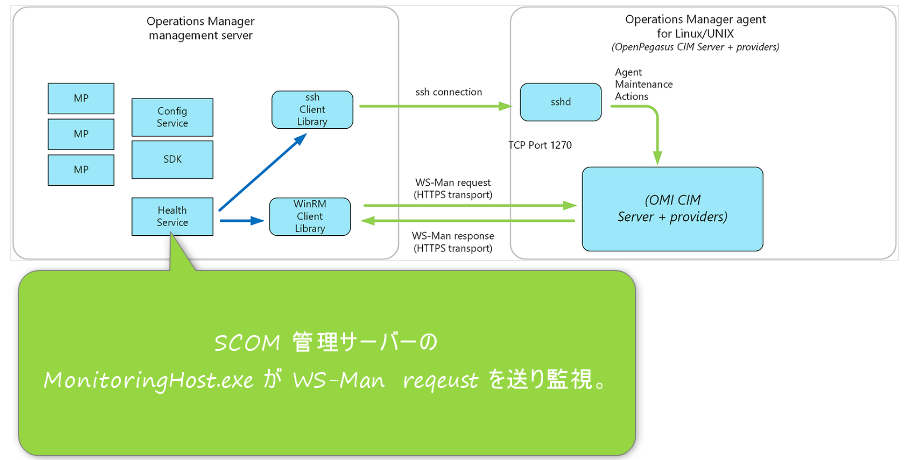

<!-- more -->
皆様こんにちは、System Center サポートチームの 佐藤 です。

本日は System Center Operations Manager（以下、SCOM） が監視のために利用するプロセスである MonitoringHost.exe が消費する仮想メモリ量が増大する話についてお伝えします。

# 目次
1. [仮想メモリを異常に消費](#仮想メモリを異常に消費)
1.1. [事象](#事象)
   1.1.1 [イベントの例 (イベント ID：2004)](#イベントの例 (イベント ID：2004))
   1.1.2 [イベントの例 (イベントID：26008)](#イベントの例 (イベントID：26008))
   1.1.3 [イベントの例 (イベントID：1530)](#イベントの例 (イベントID：1530))
1.2. [要因](#要因)
2. [アクション アカウントとログオン/ログオフに使用しているアカウントが同じであることによる他の問題事例](#アクション アカウントとログオン/ログオフに使用しているアカウントが同じであることによる他の問題事例)

## 仮想メモリを異常に消費
### 事象
突然、SCOM の管理サーバーやエージェントが導入されているマシンにてプロセスが異常にメモリを消費し、マシンがダウンするといった事象が発生することがあります。
その場合、イベント ログ [System] に以下が記録されることを確認しています。

#### イベントの例 (イベント ID：2004)
```
ログの名前：System
日時：yyyy/mm/dd hh:mm:ss 
ソース：Resource-Exhaustion-Detector
レベル：警告
タスクのカテゴリ：リソース消費診断イベント
イベント ID：2004
ユーザー：NT AUTHORITY\SYSTEM
コンピュータ：hyperv01.contoso.com
説明：Windows は仮想メモリの不足状態を診断しました。仮想メモリを多く消費したのは次のプログラムです:
*MonitoringHost.exe (4904) は 3003106107520 バイトを消費し* 、WmiPrvSE.exe (2122) は 2003314000 バイトを消費し、svchost.exe (1134) は 192024218 バイトを消費しました。
```

上記のイベントではプロセス MonitoringHost.exe が 約280GB （※）の仮想メモリを使用していることを示しています。
このイベントが記録されるタイミングでまた、SCOM に関するイベント ログ [Operations Manager] には同時にイベント ID：26008 がかなりの頻度で記録されていることも確認しています。
過去お問い合わせを頂いたお客様では、具体的な頻度の度合いは数秒で2000～3000件というかなりの頻度もございました。

※ 3003106107520 B / 1024 (KB 換算) 1024 （MB 換算）/ 1024  （GB 換算） ≒ 280 GB

#### イベントの例 (イベントID：26008)

```
ソース：Health Service Modules
日時：yyyy/mm/dd hh:mm:ss
イベントID：26008
Level：エラー
コンピュータ名：hyperv01.contoso.com
説明：コンピューター 'hyperv01.contoso.com' の Operations Manager イベント ログは壊れた状態のままです。イベント ログ プロバイダーが、問題があると思われるレコードをスキップすることによって回復を試みます。
最大 2 つのレコードがスキップされる可能性があります。
1 つ以上のワークフローがこの影響を受けました。

ワークフロー名: Microsoft.SystemCenter.Apm.Infrastructure.Monitoring.ApmAgent.APMConfigurationConflict.Monitor
      インスタンス名: hyperv01.contoso.com
      インスタンス ID: {8E315A0A-DFFD-8341-6461-A4A561E0F2D}
      管理グループ: SCOM
```

上記のイベントが記録されている状態はプロセス MonitoringHost.exe が仮想メモリを異常に消費してしまう状況が発生しており、OS 上の仮想メモリを枯渇させてしまい再起動するしか対処方法がありません。
併せて、この問題が発生致しますと Application のイベント ログにイベント ID：1530 が記録されます。

#### イベントの例 (イベントID：1530)

```
ソース：User Profile Service
日時：yyyy/mm/dd hh:mm:ss
イベントID：1530
ユーザー：NT AUTHORITY\SYSTEM
Level：警告
コンピュータ名：hyperv01.contoso.com
説明：レジストリ ファイルは他のアプリケーションまたはサービスで使用されています。ファイルはすぐにアンロードされます。レジストリ ファイルを保持しているアプリケーションまたはサービスはこれ以降正しく機能しない可能性があります

詳細 -
32 user registry handles leaked from \Registry\User\S-1-5-21-1614895754-1085031214-725345543-289007:
Process 4904 (\Device\HarddiskVolume1\Program Files\Microsoft System Center 2016\Operations Manager\Server\MonitoringHost.exe) has opened key \REGISTRY\USER\S-1-5-21-1614895754-1085031214-725345543-289007
<・・・以下、同様の内容が記録されるため割愛しています・・・>
```

こちらのイベント ID の説明の中で MonitoringHost.exe  のプロセスの記載があれば本事象に該当いたします。
そのため、こちらのイベント ログが記録されているかをまずご確認いただく方法も有効です。


### 要因
この事象の問題や要因を説明します。
こちらの問題は SCOM の管理サーバーやエージェントが利用するアクション アカウントが関連します。

SCOM は管理サーバーやエージェント上で監視を行う際に実行される処理はこのアクション アカウントによって実行される仕組みを取っておりますが、このアクション アカウントと同じアカウントを利用して OS 上で操作を行いログオフを実施すると今回の事象が発生することを確認しています。
これは OS 上でアクション アカウントと同じアカウントの操作によってログオフが実施されると User Profile がアンロードされるために発生します。

アクション アカウントでの監視はユーザーによるログオフ操作が実施されたあとも継続するため、User Profile をロードしようとします。
しかし、すでにログオフ操作のためアンロードされてしまっているためアクション アカウントは User Profile のロードを正常に行うことができず、エラーとなります。
このエラーが繰り返し発生し、エラー時に増加するヒープ領域が仮想メモリの領域を圧迫します。
仮想メモリの領域が圧迫されますと、上記のイベント ID：2004 が記録されます。

発生までの流れは以下です。

～～発生のプロセス～～
1. SCOM 管理サーバーやエージェントで利用するアカウントがアンロードされた User Profile に含まれていたレジストリ キーにアクセスしようとする。
2. アクセスが失敗し、エラーに関連する情報がヒープ領域に格納される。
3. SCOM 管理サーバーやエージェントで利用するアカウントが繰り返しレジストリ キーへのアクセスを実行し、エラーの情報がヒープに格納され続ける。
4. ヒープ領域が肥大化する。
5. 仮想メモリが枯渇する。


この挙動は SCOM 含めた COM+ アプリケーションの実装では想定されている動作でもありますため、お客様環境にてこういった状況とならないよう事前にご利用いただくアカウントについてご確認いただく必要がございます。

この事象を回避いただくための対処方法は至って単純です。
それは SCOM の管理サーバーやアクション アカウントに使用しているアカウントと OS 上へとログオン/ログオフするアカウントを異なるものに変更するだけです。

SCOM の場合ですとアクション アカウントに ローカル システム アカウントを利用することが可能ですので、アカウントを基本的にローカル システム アカウントへと変更していただく、という運用が一番シンプルです。

しかし、ローカル システム アカウントの場合ですと権限が Administrator と同等ですので、SCOM のプロセスが悪用されるリスクを懸念されるお客様もいらっしゃるかと存じます。
それを考慮した場合、ドメインのアカウントを指定するほうがリスクは小さくなります。
どのアカウントを利用するかはお客様の運用ポリシーに依存する部分でもありますので検討の上、アカウントを決定してください。

SCOM のアクション アカウントにご利用いただくための権限については以下に公開情報があるのでご覧ください。

• 公開情報
[サービス、ユーザー、およびセキュリティ アカウント](https://learn.microsoft.com/ja-jp/system-center/scom/plan-security-accounts?view=sc-om-2022)
※SCOM 2022 の情報ですが、SCOM 2019、SCOM 2016 でも同様です。


今の環境でこの Blog で案内している事象が発生する可能性があるか、というのは以下の手順で SCOM のアクション アカウントを確認してください。
以下の手順ではアクション アカウントに指定されているアカウントを確認していただき、そのアカウントがログオン/ログオフを実施するアカウントであるか確認できます。

<<確認手順>>
以下の手順にてエージェントのアクション アカウントをご確認が可能です。

1. SCOM 管理コンソールを起動し、[管理] ペインを開きます。
2. 左ペインの [プロファイル] をクリックします。
3. 一覧から [既定のアクション アカウント] をダブルクリックします。
4. ウィザード画面上で、[次へ] をクリックします。
5. 全般プロパティ画面にて [次へ] をクリックします。
6. 実行アカウント画面に一覧から、問題が発生している SCOM 管理サーバー や SCOM エージェントに設定されているアカウント名を確認します。


手順は以上です。

## アクション アカウントとログオン/ログオフに使用しているアカウントが同じであることによる他の問題事例

事例：以下アカウントで指定しているユーザーが同じである場合
　・SCOM 管理サーバーの  MonitoringHost.exe のアクションアカウント
　・SCOM 管理サーバーにログインするアカウント

この場合、SCOM 管理サーバーの OS からログオフした際に SCOM 管理サーバーの  MonitoringHost.exe で監視している linux コンピューターがグレーアウトする事例がございます。
下図構成となるため、ログオフした際に MonitoringHost.exe が動作するために必要な情報（例えばレジストリキーに設定している値）などもログオフとともに参照できなくなり、linux コンピューターが監視不能状態となりグレーアウト状態になる場合があります。

[Operations Manager エージェント](https://learn.microsoft.com/ja-jp/system-center/scom/plan-planning-agent-deployment?view=sc-om-2022&tabs=Windows#linuxunix-agent)




上記事例もございますため、アクション アカウントとログオン/ログオフに使用しているアカウントが同じ場合はどちらかのアカウントを変更してくださいするようお願いいたします。


