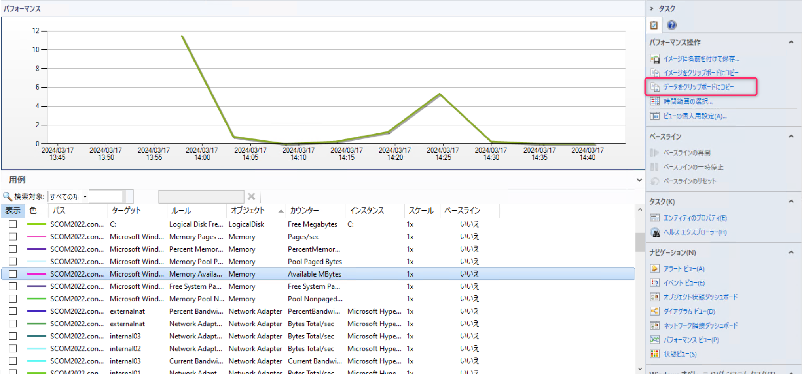
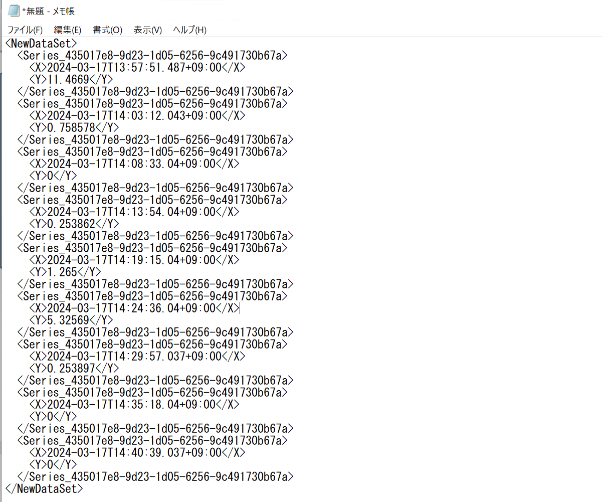
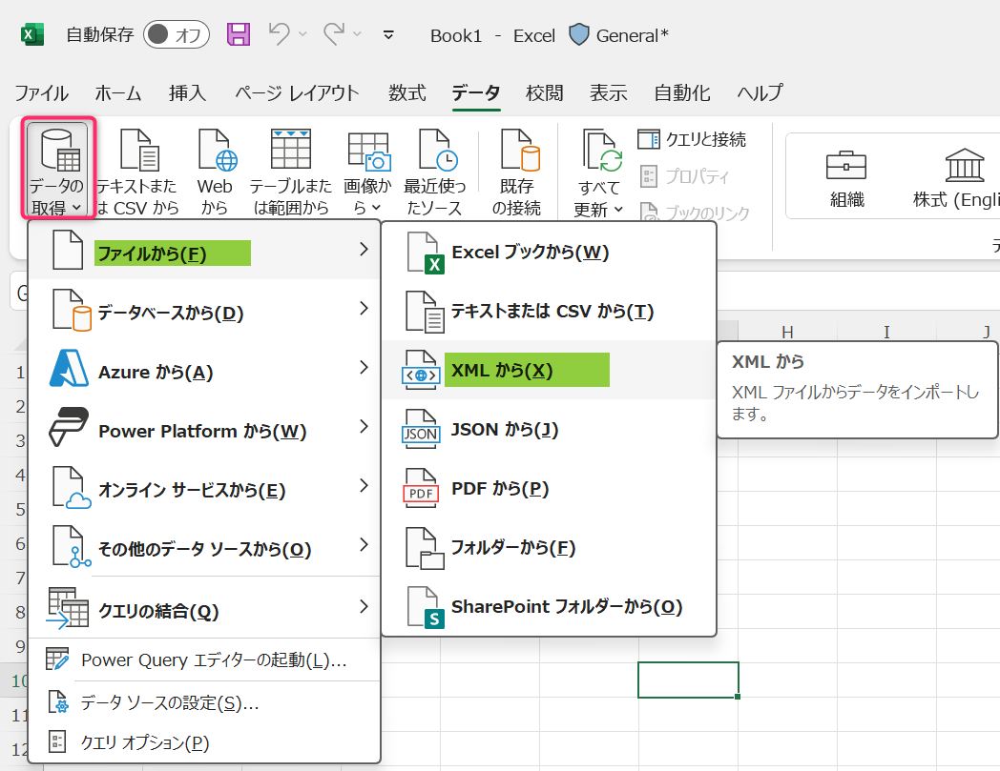
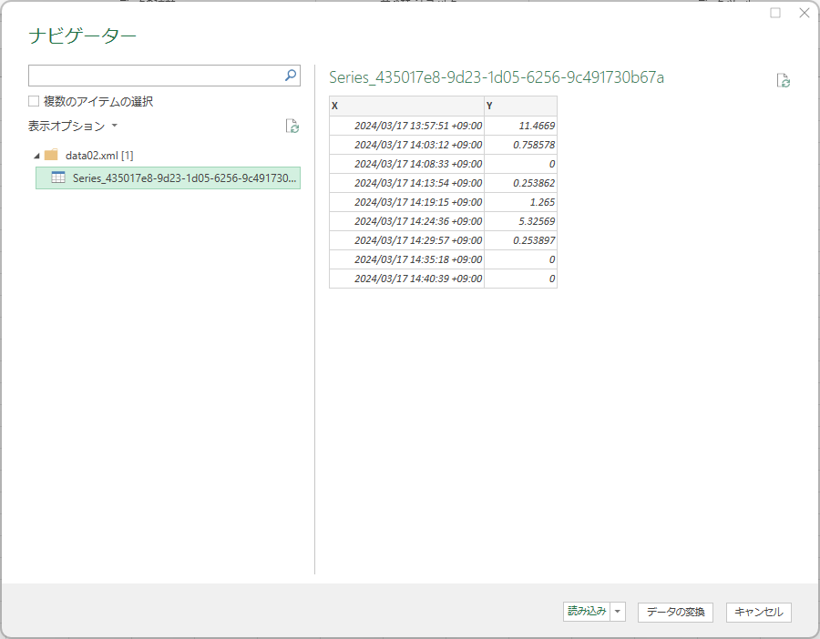
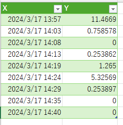

<!-- more -->
皆様こんにちは、System Center サポートチームの 佐藤 です。

本日は System Center Operations Manager（以下、SCOM） のパフォーマンス ビューに表示されているデータを取得する方法をご紹介いたします。

SCOM では採取したパフォーマンス カウンターを下図のようにグラフ表示するパフォーマンス ビュー機能がございます。
このグラフの基データを一覧情報として取得したい旨のお問い合わせがございますので、その具体的な方法を紹介します。

//パフォーマンス ビューの画面

パフォーマンス ビュー画面の右ペインにある [データをクリップボードにコピー]を押下すると、下図のようにメモ帳などテキストエディタにコピーしたデータを張り付けすることが出来ます。張り付けたデータを xml データとして保存してください。

続けて excel ファイルを開きます。
データ タブにある ボタン[データの取得] - [ファイルから] - [XML から] と選択し、開かれるファイル選択画面で上で保存した xml ファイルを選択します。

ファイルを選択すると下図のように [ナビゲーター] 画面で取り込み後のイメージ画面が出てきますので、[読み込み] ボタンを教えてください。

上記作業の結果、下図のように X 軸として日時、Y 軸としてパフォーマンス カウンターを値を一覧情報で確認いただけます。

