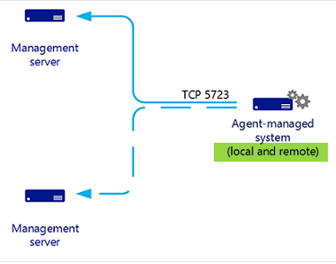
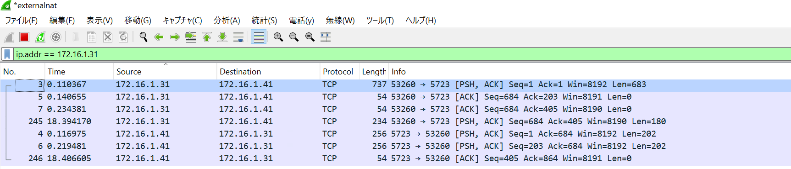
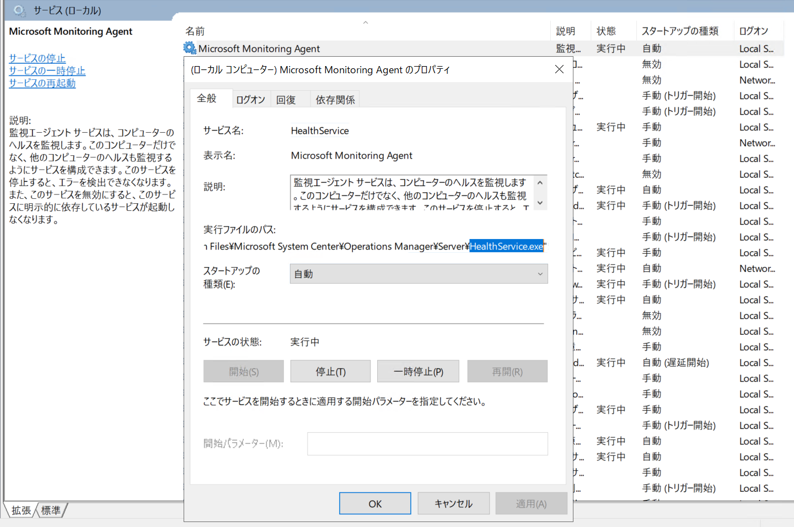
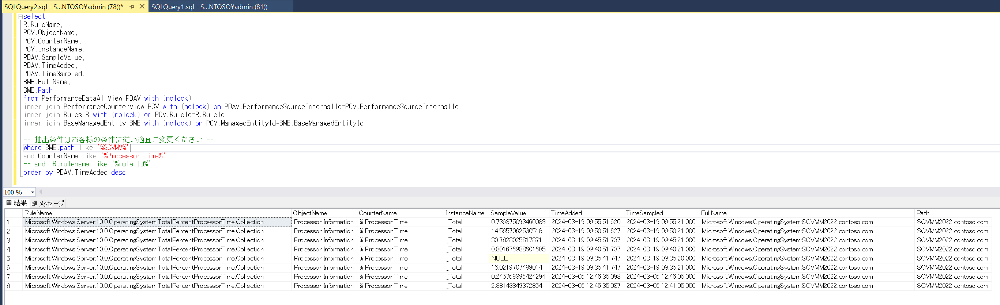

<!-- more -->
皆様こんにちは、System Center サポートチームの 佐藤 です。

本日は System Center Operations Manager（以下、SCOM） に採取されたパフォーマンス カウンターの情報を DB から採取する方法についてご紹介いたします。

## 留意事項
Update Rollup の適用などにより DB のテーブルの型などが変更される可能性がございます。
各テーブルの仕様については公開しておりません。

## パフォーマンス カウンターが採取される仕組み
せっかくですので、まず実際に DB からパフォーマンスカウンターを取得するクエリの説明の前に Microsoft Monitoring Agent （以後、MMA と記載します）がパフォーマンスカウンターを採取して、SCOM 管理サーバーに連携する仕組み、流れをご紹介いたします。
実際のパフォーマンス カウンターを採取する方法を知りたい方は [DB からパフォーマンス カウンターを取得するクエリ](## DB-からパフォーマンス-カウンターを取得するクエリ)  からご参照ください。

### エージェントと SCOM 管理サーバーの通信
以下ページに記載のとおりですが、MMA は採取した情報（パフォーマンス カウンター情報など）を SCOM 管理サーバーへ TCP 5723 ポート向け送ります
下図で "(local and remote)" と記載ございますが、本日の内容は local つまり、MMA がインストールされているマシンの情報を採取する内容とご認識いただければと存じます。
[Operations Manager エージェント](https://learn.microsoft.com/ja-jp/system-center/scom/plan-planning-agent-deployment?view=sc-om-2022&tabs=Windows#communication-between-agents-and-management-servers)



SCOM 管理サーバーで NW キャプチャを採取すると以下のように確認することが出来ます。
| IP アドレス | 通信しているコンピューター |
| ------------ | ------------ |
| 172.16.1.31 | 監視対象コンピューター |
| 172.16.1.41 | SCOM 管理サーバー |




### MMA の実行プロセスとパフォーマンスカウンターを採取するプロセス
監視対象コンピューター （※）にインストールされた MMA は下図でわかるよう Windows のサービスとして登録され、その実行ファイル名は ”HealthService.exe” です。



実際にパフォーマンスカウンターを採取するプロセスは ”HealthService.exe”  から呼び出される ”MonitoringHost.exe” となります。
※ SCOM 管理サーバーにも MMA はインストールされております

MMA がインストールされているマシンには SCOM 管理サーバーから情報を採取するための xml 形式の設定ファイルがダウンロードされます。
この xml ファイルの設定（対象パフォーマンスカウンターや実行インターバル、など）に従い ”MonitoringHost.exe” が採取こととなります。

具体的には xml ファイル内に定義されたスクリプト（その中で WMI クエリなどを実行）に従い採取しております。

ダウンロードされた xml ファイルは以下パスにて確認いただけます。
C:\Program Files\Microsoft Monitoring Agent\Agent\Health Service State\Management Packs


## DB からパフォーマンス カウンターを取得するクエリ
ここまでで MMA がパフォーマンス カウンターを採取する仕組みを記載しましたが、SCOM 管理サーバーまで届いたパフォーマンスカウンターは Operations Manager DB に格納されます。
Operations Console のパフォーマンス ビューなどで確認できる監視対象のパフォーマンス カウンターはこの DB の情報を取得して、表示させている事となります。

そのため、Operations Console から取得できないような情報を DB から SQL クエリを実行して採取することが出来ます。

具体的には下記クエリとなります。

//クエリ例
```
select 
R.RuleName,
PCV.ObjectName,
PCV.CounterName,
PCV.InstanceName,
PDAV.SampleValue,
PDAV.TimeAdded,
PDAV.TimeSampled,
BME.FullName,
BME.Path    
from PerformanceDataAllView PDAV with (nolock)
inner join PerformanceCounterView PCV with (nolock) on PDAV.PerformanceSourceInternalId=PCV.PerformanceSourceInternalId
inner join Rules R with (nolock) on PCV.RuleId=R.RuleId
inner join BaseManagedEntity BME with (nolock) on PCV.ManagedEntityId=BME.BaseManagedEntityId

-- 抽出条件はお客様の条件に従い適宜ご変更ください --
where BME.path like '%サーバー名%'
and CounterName like '%カウンター名%'
and  R.rulename like '%rule ID%'
order by PDAV.TimeAdded desc

```
例えば上記クエリの  ”サーバー名” と "カウンター名"に実際の監視対象コンピューターと確認したいパフォーマンス カウンターを入力して実行すると下図のように取得することが可能となります。

// SSMS でのクエリ実行イメージ


