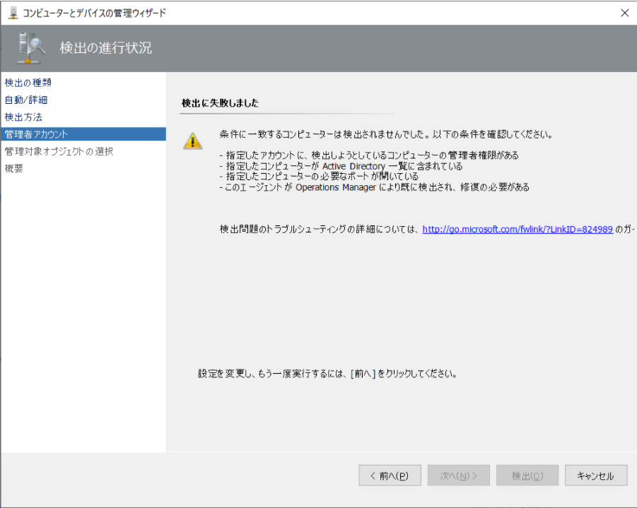

<!-- more -->
皆様こんにちは、System Center サポートチームの 佐藤 です。

本日は System Center Operations Manager（以後 SCOM）  2019 で変更のあった仕様の 1 つをご紹介いたします。
2022 年 8 月現在の状況として、（[SCOM 2012 R2の延長サポートのフェーズが2022年7月に終了](https://docs.microsoft.com/ja-jp/lifecycle/products/microsoft-system-center-2012-r2-operations-manager)）したことに伴い、SCOM 2019 や 2022 など後継バージョンの環境を新規構築して移行を進めている、もしくはご計画されているお客様もいるかと存じます。

SCOM 2019 の新規環境を構築後に Windows コンピューターを検出する際に SCOM インストール ユーザ以外で検出を試みると下図のエラー（対象コンピューターがいない）と出力される場合がございます。

この事象はこれまでのバージョンと異なり検出する実行アカウントに対しててサービス ログオンアクセス許可を有効にいない場合に発生している可能性がございます。
設定をされていなければ、下記手順にて一度設定をいただき、事象がfai改善するかご確認いただければと存じます。

SCOM 管理サーバーにて以下設定をする事で、サービス ログオンアクセス許可を有効にできます。
1. SCOM 管理サーバーに管理者特権でサインインします。
2. [管理ツール] に移動し、 [ローカル セキュリティ ポリシー] をクリックします。
　例えば、Windows Server 2016 以降では、スタートメニューを開き、[Windows 管理ツール] -> [ローカル セキュリティ ポリシー] をクリックします。
3. [ローカル ポリシー] を展開し、 [ユーザー権利の割り当て] をクリックします。
4. 右側のウィンドウで、 [サービスとしてログオン] を右クリックし、 [プロパティ] を選択します。
5. [ユーザーまたはグループの追加] オプションをクリックし、以下どちらかを追加します。
6. サーバーを再起動します。

参考サイト：https://docs.microsoft.com/ja-jp/system-center/scom/enable-service-logon?view=sc-om-2019#enable-service-log-on-permission-for-run-as-accounts

> 対象バージョン：
>　System Center Operations Manager 2019
>　System Center Operations Manager 2022
