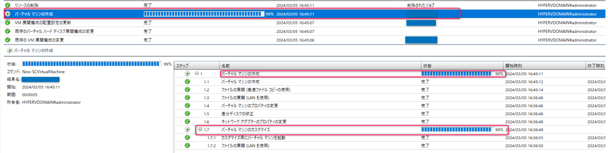

<!-- more -->
皆様こんにちは、System Center サポートチームの 佐藤 です。

本日は System Center Virtual Machine Manager で Linux VM をテンプレートから作成する際に下図のようにタスク進捗率が 99 % で止まり作成が完了しない問題についてご紹介します。

## 事象
ライブラリサーバーに配置している RHEL もしくは CentOS  の VM テンプレート（vhdx）ファイルを用いて、VM を作成しようとした場合に下図のようにタスク進捗率が 99 % で止まってしまい、60 分ほどでタイムアウトし作成が失敗する事例があります。



この問題の際に以下特徴がある場合は後述する回避策で改善できる可能性がございます。
　・ステップ 1.7 ”バーチャル マシンのカスタマイズ” の進捗率が 99 %で同様に止まっており、他ステップは完了している
　・Hyper-V コンソールから確認した際に作成を試みている VM が存在し、OS にログインできる


## 原因
上記事象の場合、scvmmguestagent を起動できておらず、scvmmguestagent.bin が、SCVMMで仮想マシンを作成する際に設定した OS のプロファイル情報を反映させることができず処理が止まっている原因と考えられます。

## 改善方法
まず OS にログインして以下コマンドを実行してみてください。
```
/opt/microsoft/scvmmguestagent/bin/scvmmguestagent.bin
```
こちらのコマンドによりタスクが完了した場合は上述した原因のため発生した事象となります。

この場合scvmmguestagent を起動に必要な言語パックインストールが入っていないことが要因と考えられます。
改善策として VM テンプレート作成元となった OS 上で、SCVMM ゲストエージェントインストール後に下記コマンドを実行し、再度テンプレートを作成して事象が改善するか確認いただけますと幸いです。
```
dnf install langpacks-en glibc-all-langpacks -y
```


