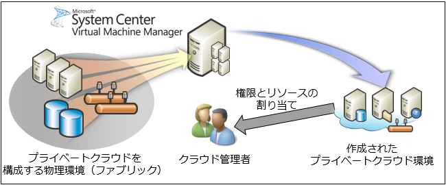
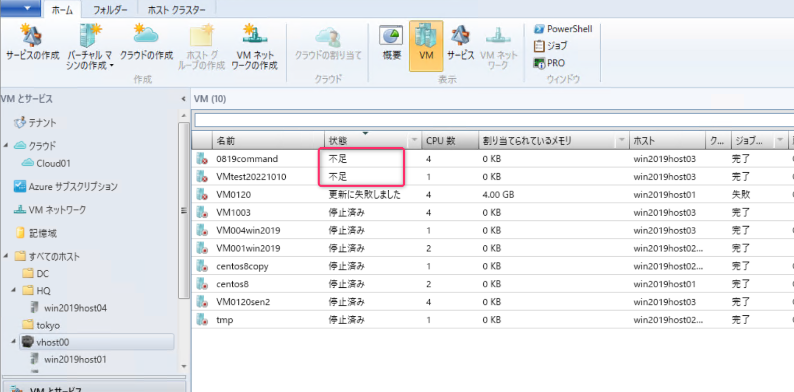
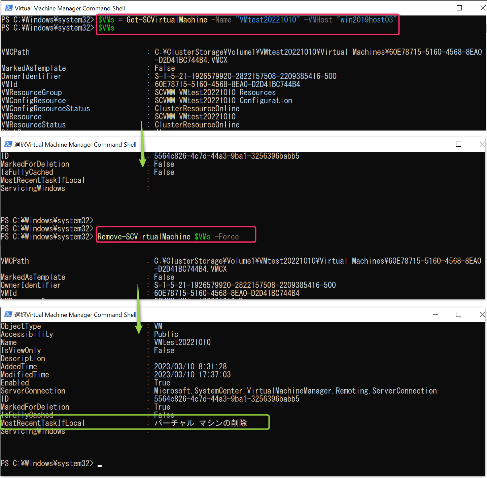

<!-- more -->
皆様こんにちは、System Center サポートチームの 佐藤 です。

本日は System Center Virtual Machine Manager （以後、SCVMM）で管理している VM を強制削除して、再登録する方法をご紹介いたします。

## SCVMM の DB で保持している情報が不整合になってしまうシナリオ
下図は SCVMM の構成イメージとなりますが、SCVMM では管理している VM や Hyper-V ホストの情報を DB （SQL Server）で保持しております。



発生シナリオは幾つかございますが、例えば  SCVMM で管理している VM を WSFC マネージャーで別ホストにマイグレーションした場合やHyper-V マネージャーから VM を削除した場合、SCVMM がその VM を見失ってしまい SCVMM のコンソールで見た場合に VM のステータスが ` ”不足” （英語表記： missing）` となってしまう場合があります



参考：[不足している状態の仮想マシンを削除する](https://learn.microsoft.com/ja-jp/troubleshoot/system-center/vmm/remove-missing-virtual-machines)

また上記公開情報にも記載しているように ステータスが ”不足”になるだけでなく、同じ VM が複数のホスト上にあるように見え、重複して存在しているように見える場合もございます。

上述したようなシナリオの場合、下記手順で一度 SCVMM の DB から VM や Hyper-V ホストの情報を削除して、再登録することで是正できる場合がありますのでその手順を記載いたします。


## VM を削除して再登録する手順
```
1.SCVMM サーバーに SCVMM の管理者ロールに属するユーザーでログインし、Virtual Machine Manager Command Shell を管理者として起動します
2.以下のコマンドレットを実行します。Nameオプションには仮想マシン名、VMHostオプションには仮想マシンを所有する仮想化ホストサーバー名を指定します。
　$VMs = Get-SCVirtualMachine -Name "<仮想マシン名>" -VMHost " <仮想マシンを所有する仮想化ホストサーバー>"
3.以下のコマンドを実行し、今回削除する対象である仮想マシン の情報のみが表示されることを確認します。
　$VMs
4.Remove-SCVirtualMachine コマンドレットを Force オプションと、対象仮想マシンの情報が格納された変数を指定し、実行します。
　Remove-SCVirtualMachine $VMs -Force
　** -Force オプションをつけない場合、仮想マシン自体がファイルごと削除されます。ご注意ください。**
　上記実行後、SCVMM より対象仮想マシンの情報が削除されていることをご確認ください。
5.SCVMM コンソールにてホストに対して [バーチャルマシンの更新] を実行し、削除した仮想マシンを改めて検出します。
```
上記シナリオで記載したように 2 つの Hyper-V ホスト上に同じ VM が登録されてしまっている場合は、実態として存在していない Hyper-V ホスト上の VM を削除したいので、
その場合 ` -VMHost ` で指定するホストは削除したい VM をホストしている Hyper-V ホストを指定ください。

**VM の再登録が不要であれば、手順は 5 は実施いただく必要ございません。**

■コマンド実行時の画面


*作業の影響範囲*
上記コマンドの影響範囲につきまして、上述している通り、 SCVMM が持つデータベース内の情報のみ削除するため、**仮想マシンへの動作影響はありません**。
しかしながら、SCVMM が持つ固有の情報（規定では使用されていない項目となります）については削除されます。
こちらは Hyper-V ホストでは管理しておらず、SCVMM のみが管理している情報であるためです。
固有の情報は以下が該当致します。
・仮想マシンのコストセンター (仮想マシンのプロパティ画面の全般タブ)
・仮想マシンのタグ (仮想マシンのプロパティ画面の全般タブ
・仮想マシンのクラウド (仮想マシンのプロパティ画面の全般タブ
・仮想マシンのカスタム プロパティ (仮想マシンのプロパティ画面のカスタム プロパティ タブ)
・仮想マシンのセルフサービス クォータポイント (仮想マシンのプロパティ画面の設定タブ)
・仮想マシンの所有者 (仮想マシンのプロパティ画面のアクセスタブ)
・仮想マシンのセルフサービス所有者、セルフサービスユーザー (仮想マシンのプロパティ画面のアクセスタブ)

